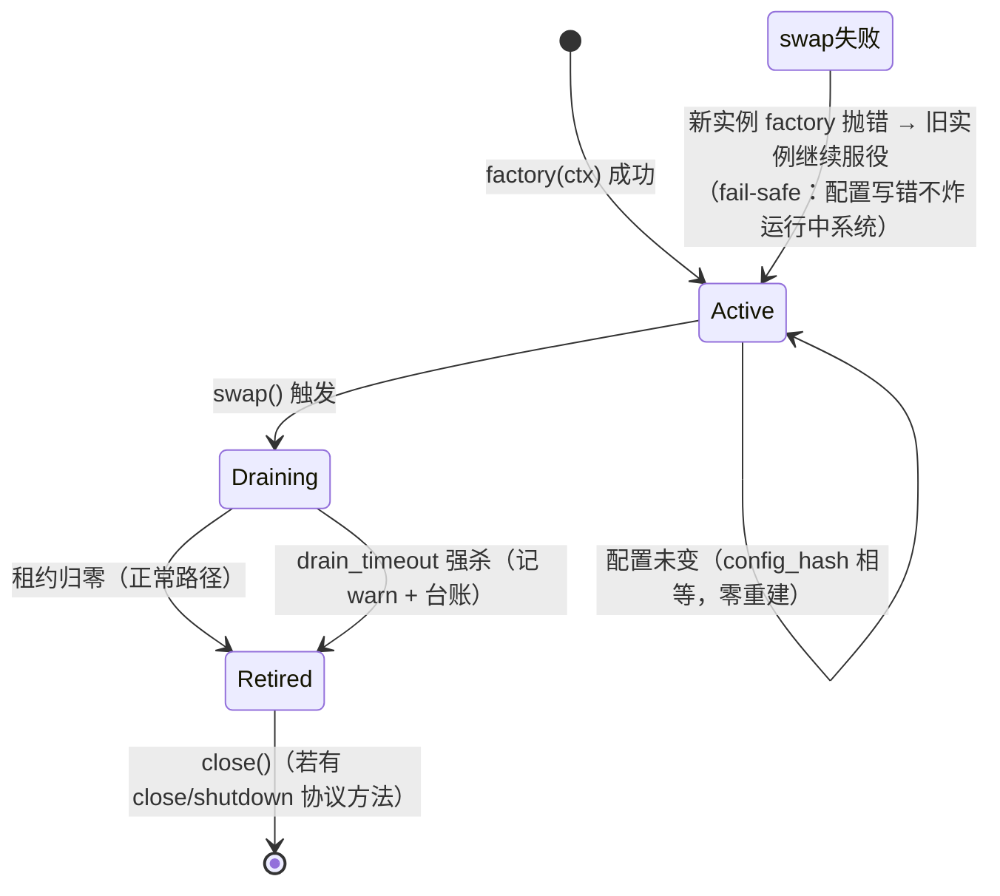

# LingClaude 彻底重构设计 —— CodingRuntime 热拔插闭环（架构师视角）

- **提案人**: 灵克 (lingclaude)，2026-09-28
- **角色**: 架构设计师（宏观视角）——插片体系、主干终态、统一 swap 协议、与存量资产整合关系
- **状态**: OPEN — 待族长裁决后拆阶段实施
- **基线核实**: 本提案全部代码事实均于 2026-09-28 当轮读源码确认（引用带 文件:行 锚点）

---

## 〇、与既有提案的关系（先说清，不另起炉灶）

| 存量资产 | 本设计的态度 |
|---|---|
| `proposals/2026-09-09_LINGYUAN_V3_REFACTOR_PLAN.md`（A1/A2 结构债） | **承接**：V3 做了"拆开"（wiring manifest 化），本设计补"热拔插闭环"——V3 的 P2.c "逐个转 seam"正是本文档的具体化 |
| `core/policy_loader.py`（207 行，mtime watch + hot_update） | **复用为数据层**，只补一个变更通知口，不重写 |
| `core/seam.py` SeamRegistry（全局 type 注册表 + PLUG_LEVELS L1/L2/L3 + N3 命名空间） | **复用为工厂/类型层**，在其上加"实例槽"层，不 fork 第二注册表 |
| `engine/coding_wiring.py` CODING_WIRING_MANIFEST（14 项）+ `core/policies/wiring_manifest.yaml`（57 项） | **扩展而非替代**：manifest 条目加 slot 元数据字段，装配路径统一走槽 |
| `tests/test_iron_law_guards.py` M1-M5 + `tests/test_p04_arch_guards.py` G1/G2 + `scripts/arch_guard_gate.sh` | **挂载点**：新增守卫进同一门禁，不造新门禁 |

一句话：**V3 解决了"主干不知插片"（装配数据化），本设计解决"插片不知热更"（实例生命周期数据化）。**

---

## 一、架构总览

### 1.1 目标形态

```mermaid
flowchart TB
    subgraph TRUNK["主干（永不变）"]
        CR["CodingRuntime<br/>__init__ = config + SlotTable + assemble()<br/>close() = slots.drain_all()"]
        ST["SlotTable（实例槽表）<br/>epoch / lease / swap"]
        LM["LingMate 2T3A<br/>create/transition/query"]
    end

    subgraph ASM["装配层（数据，不是代码）"]
        MF["wiring_manifest.yaml<br/>+ slot 元数据（config_key/plug_level/stateful）"]
        SB["SlotManager<br/>assemble / rebind / on_policy_changed"]
    end

    subgraph REG["注册层（复用 seam.py）"]
        SR["SeamRegistry<br/>type → factory（全局）"]
        PL["PLUG_LEVELS L1/L2/L3"]
    end

    subgraph CFG["配置层（复用 policy_loader.py）"]
        POL["PolicyLoader<br/>YAML 缓存 + mtime watch"]
        LS["listener 通知口（新增，唯一扩展点）"]
    end

    subgraph PLUGINS["插片（11+14 全部入槽）"]
        direction LR
        SL["无状态插片<br/>VerificationGate<br/>PatternRecognizer<br/>LoopDetector<br/>VerifyCadence"]
        SF["有状态插片<br/>TodoStore(SQLite)<br/>SessionRuntime<br/>ModelProvider"]
        TL["工具插片（现有14项）<br/>bash/file/grep/..."]
    end

    SUB["子代理/派生上下文<br/>SlotHandle 惰性解析<br/>（不持实例快照）"]

    POL --> LS --> SB
    MF --> SB
    SR --> SB
    SB --> ST
    ST --> CR
    CR --> LM
    ST -.->|slot(name) 读穿| SL & SF & TL
    SUB -.->|调用时解析| ST
```

### 1.2 核心设计决策（一句话版）

1. **槽（Slot）是唯一热缝**：一切"运行中可换"的东西只经 SlotTable 换手，主干、工具 mixin、子代理全部读穿槽，谁都不许缓存实例。
2. **两级注册表合一**：SeamRegistry 管"type→factory"（全局、静态面），SlotTable 管"name→live instance + epoch"（会话、动态面）。SlotManager 是唯一同时碰两者的人。
3. **swap 语义全库统一一套**（见 §四），任何插片不许自创热更协议。
4. **配置变化→实例重建的通路只有一条**：PolicyLoader → listener → SlotManager.rebuild(config_key) → Slot.swap()。

---

## 二、插片清单与划分依据

### 2.1 划分判据（三维）

- **变化频率**：会被配置/策略/实现替换吗？会 → 插片。
- **状态性**：实例内持有必须跨 swap 存活的状态吗？→ 决定迁移策略（§五）。
- **派生性**：是否纯由另一插片推导？→ 派生物**不设独立槽**，随源槽重建。

### 2.2 11 个直构对象的处置（对应 coding.py:44-99 实测）

| # | 对象（coding.py 锚点） | 分类 | 槽名 | 拔插等级 | 状态迁移策略 |
|---|---|---|---|---|---|
| 1 | `_model_provider`（:46-59，含惰性 create_provider 兜底） | 有状态（连接/凭据） | `model_provider` | L1 | 在途请求租约跑完，新请求走新实例（现有 switch_model 的正规化） |
| 2 | `_pattern_recognizer`（:60） | 无状态服务 | `pattern_recognizer` | L3 | 无状态直接换；`register_detector()` 上提为 manifest `detectors:` 列表（注册数据化） |
| 3 | `verification_gate`（:61） | 无状态（计数器可重置） | `verification_gate` | L2 | YAML 驱动 `from_config`（工厂已存在却被主干绕过——本次正名）；降级 = NoopGate（enabled=False 等价物） |
| 4 | `_todo_store`（:77） | 有状态（SQLite 连接） | `todo_store` | L2 | 状态在库文件不在进程：swap = 关旧连接开新连接指向同库；降级 = 内存 TodoStore |
| 5 | `_todo_handlers`（:78） | **派生物** | —（不设槽） | — | `make_handlers(slot.todo_store)`，随 todo_store swap 自动重算 |
| 6 | `_lsp_provider`（:82，恒 None 空壳） | **死槽** | —（删除） | — | 生产路径已走 LspSessionPool（注释自述）；直接删槽，legacy 注入走 overrides |
| 7 | `_loop_detector`（:90） | 无状态（计数器瞬时） | `loop_detector` | L3 | streak 计数声明为易失：swap 清零可接受（文档化）；如需温 swap 走 export_state |
| 8 | `_session_runtime`（:96，`SessionRuntime(self)` 持引擎反向引用） | 有状态（StateStore 后端） | `session_runtime` | L1 | 引擎引用是不变量，重建时重注；其 StateStore 后端按铁律 2 降级为**子插片槽**（分形） |
| 9 | `_verify_cadence`（:99） | 无状态（滑动窗口瞬时） | `verify_cadence` | L3 | 窗口声明易失；env 开关迁入 YAML |
| 10 | data_dir/session_id 解析（:64-77） | **配置推导** | —（入 SlotManager ctx） | — | 不是对象，是装配上下文字段 |
| 11 | sandbox_policy / plan_mode / guards（:141-175） | 无状态 | `sandbox_policy` 等 | L2 | 已在 _setup_tools 尾部，顺势入 manifest |

另：既有 `CODING_WIRING_MANIFEST` 14 项（bash/file/registry/pipeline/...）全部补 slot 元数据，统一走同一装配/热更通路——**消灭"一半走 manifest 一半裸构"的双轨制**，这是"伪主干"观感的真正来源。

---

## 三、主干瘦身后的接口骨架

### 3.1 CodingRuntime 终态（__init__ 只剩三件事）

```python
# lingclaude/engine/coding.py —— 终态骨架（签名级）
class CodingRuntime(...Mixins...):
    """主干：2T3A 调用 + 装配入口。不出现任何插片类名（M1/M3 守卫锁定）。"""

    def __init__(self, config=None, model_provider=None, overrides=None):
        self.config = config or lingclaudeConfig()
        # ① 槽表：主干唯一的"插片感知"，且只感知协议不感知类型
        self._slots = SlotTable(owner=self)
        # ② 装配：manifest + overrides（测试/宿主注入缝，语义同现有 assemble_coding）
        SlotManager.assemble(
            manifest=load_manifest("coding_runtime"),      # PolicyLoader 数据
            slots=self._slots,
            ctx=AssemblyContext(config=self.config, runtime=self),
            overrides={"model_provider": model_provider, **(overrides or {})},
        )
        # ③ 工具注册表消费（specs 表机制，现状保留）
        register_all_tools(self.slot("registry"), self)

    def slot(self, name: str) -> Any:
        """读穿：每次调用解析当前实例。Mixin/工具层唯一的插片获取方式。"""
        return self._slots.get(name)

    def lease(self, name: str) -> SlotLease:
        """长任务用：持有租约保证在途期间实例不被 close。"""
        return self._slots.lease(name)

    def close(self) -> None:
        self._slots.drain_all(timeout=5.0)   # 替代现有散落的 LSP/线程池清理
```

### 3.2 兼容桥（过渡期必须，避免 200 处调用点一次改完）

```python
    # 过渡期 property 桥：读穿槽，不改调用点。守卫只锁 __init__ 不锁这里；
    # 每个 property 标 # SLOT-BRIDGE，P5 阶段批量消除。
    @property
    def verification_gate(self):  # SLOT-BRIDGE
        return self._slots.get("verification_gate")
```

> **层级错位修正**：`switch_model()` 现挂 QueryEngineModelMixin（query_engine_model_mixin.py:22），但 provider 槽在 CodingRuntime——重构后统一为 `slots.swap("model_provider", new_cfg)`，mixin 方法退化为薄转发，层级归位。

---

## 四、热更机制：统一 Slot 协议

### 4.1 Slot 三要素（全库唯一热更协议）

```python
# lingclaude/core/slot.py（新文件，~150 行，无插片知识，M1/M3 合规）
@dataclass
class SlotSpec:
    name: str
    factory: Callable[[AssemblyContext], Any]
    config_key: str | None = None     # 关联 PolicyLoader 策略名；None=不随配置热更
    plug_level: str = "L3"            # 复用 seam.py PLUG_LEVELS 语义
    stateful: bool = False
    fallback: Callable[[], Any] | None = None   # L2 降级实现（Noop 范式，禁主干 if-else）

class Slot:
    """实例 + epoch + 租约。赋值即原子换手（GIL 保证引用赋值原子性）。"""
    def get(self) -> Any: ...                     # 当前实例
    def lease(self) -> "SlotLease": ...           # 在途保护
    def swap(self, new: Any, *, drain_timeout: float = 30.0) -> bool: ...
    def epoch(self) -> int: ...                   # 单调递增，派生上下文对表用

class SlotLease:
    """with runtime.lease("model_provider") as p: p.complete(...)
    语义：租约存活期间 old 实例保证不被 close（drain 等待或超时强杀并记日志）。"""
```

### 4.2 swap 状态机（温和 swap，全插片遵守）



**关键不变式**：
1. **先建后换**：新实例 factory + Protocol 校验 + （可选）selftest 全绿才换手；任何一步失败旧实例原地不动。
2. **换手即生效**：`slot.get()` 下一次调用解析到新实例，无缓存窗口。
3. **在途不炸**：旧实例对象被租约引用自然存活（Python GC 语义），swap 只推迟 `close()`，不中断调用。
4. **config_hash 判变**：重建判据是解析后配置内容的 hash，不是 mtime——消除"文件变了内容没变"的空重建。

### 4.3 配置触达通路（PolicyLoader 整合，唯一扩展点）

PolicyLoader 现状是**纯轮询、无订阅**。扩展一个口（新增 ~30 行，不改现有语义）：

```python
# policy_loader.py 追加
def register_listener(name: str, cb: Callable[[dict], None]) -> None: ...
# get()/hot_update() 检测到内容变化时回调。SlotManager 在 assemble 时
# 对每个 config_key != None 的 SlotSpec 注册 listener → slot.rebuild()
```

- **主动路径**：`hot_update()`（wiring 装配前/SIGHUP/管理命令）→ listener → rebuild。
- **被动路径**：槽 `get()` 时以既有 `_WATCH_INTERVAL`（30s）节流对表 PolicyLoader——文件改了最迟一个节流周期生效，与现状语义一致。
- **不推荐** inotify 守护线程：与现有 mtime 范式相比增加故障域，收益不抵复杂度（同类教训：Envoy 也是轮询 xDS 为主）。

### 4.4 派生上下文（子代理）不持快照

现状：sub_agent.py:47-53 构造函数收 `provider` 实例——快照。改造：

```python
# 子代理 ctx 持 SlotHandle 而非实例
class SlotHandle:
    def __init__(self, table: SlotTable, name: str): ...
    def resolve(self) -> Any: return self._table.get(self._name)   # 调用时解析

# sub_agent.py:119 调用点
result = self._provider_handle.resolve().complete(...)
```

- 子代理与父会话**共享同一 SlotTable 引用**（轻量），swap 自动跟随；
- 需要"钉住"模型做对照实验时，显式 `lease()` 整个子代理生命周期——钉住是**显式决策**，不是默认快照。

---

## 五、状态迁移与降级策略

### 5.1 有状态插片协议（铁律 2 分形落地）

```python
class StatefulPlugin(Protocol):
    def export_state(self) -> dict: ...          # 进程内状态快照
    def restore_state(self, snap: dict) -> None: ...
    def close(self) -> None: ...
```

| 插片 | 状态归属 | 迁移方案 | 降级（L2 fallback） |
|---|---|---|---|
| `todo_store` | **状态在 SQLite 文件，进程内只有连接** | 最优情形：swap=关旧连开新连，零迁移。session_id 变更场景由 export_state（dump 未完成任务）兜底 | InMemoryTodoStore（同一 make_handlers 消费，接口一致） |
| `session_runtime` | StateStore 后端（json 文件） | 后端做成子槽（分形）；swap 后端 = export→restore；引擎反向引用在重建时重注（引擎是不变量，不构成迁移负担） | StateStore 缺省 json 后端（现状即降级路径，session_runtime.py:22-28 已有 fail-soft 雏形） |
| `model_provider` | 凭据池/健康度/在途 HTTP | 凭据池本身已独立模块（model/credential_pool.py）不随 provider 实例走；在途请求靠 lease；健康度跨 swap 由 export_state 传递 | create_provider 失败 → 保持 None fail-soft（现状语义，coding.py:51-58） |
| `loop_detector` / `verify_cadence` | 纯内存计数器 | **声明易失**（L3）：swap 清零，文档化接受。若审计要求连续 streak，走 export_state 升级 L1——留口不预建 | — |

### 5.2 降级纪律

- 降级实现**本身是插片**（SlotSpec.fallback），主干不出现 `if slot is None:` 分支（铁律：禁止主干 if-else 降级，seam.py L2 条文）。
- 每槽的 plug_level 入 manifest 存档，M5 截肢测试按声明等级验收（L1 必须互换不崩、L2 必须缺席降级、L3 必须缺席不崩）。

---

## 六、架构守卫设计（挂载既有门禁，不造新体系）

| 守卫 | 类型 | 内容 | 挂载点 |
|---|---|---|---|
| **G9 主干直构禁令** | AST 静态（红灯型） | coding.py 主干（`__init__`/`_setup_tools` 残余）不得出现插片类构造调用与 module-level 插片 import；白名单 = SlotTable/SlotManager/register_all_tools | tests/test_p04_arch_guards.py + arch_guard_gate.sh |
| **G10 直构计数棘轮** | 基线计数（红灯型，仿 G1） | 主干内直构插片数基线只降不升：11 →（每阶段递减）→ 0 | 同上，复用 G1 基线机制 |
| **M6 swap 行为测试** | 行为测试（法，终审） | ① 改 YAML → slot epoch 递增且新实例服役；② 持租约的在途调用仍拿到旧实例跑完；③ factory 抛错 → 旧实例原地不动；④ config_hash 相同 → 零重建 | tests/test_iron_law_guards.py |
| **M5 扩展** | 行为测试 | 截肢面扩到 CodingRuntime 全部槽：按声明 plug_level 逐级 unregister，主干继续应答 | 同上 |
| **SLOT-BRIDGE 计数** | 告警级（数字型，仿 G3） | 兼容桥 property 数量只降不升，防"桥变永久居民" | 数字型守卫，入门禁会重演噪音（arch_guard_gate.sh 头部教训），只做趋势告警 |

---

## 七、分阶段实施（每阶段独立验收、不中断现有功能）

| 阶段 | 内容 | 验收（机械判据） | 风险隔离 |
|---|---|---|---|
| **P0 槽内核** | 新建 `core/slot.py`（SlotTable/Slot/SlotLease/SlotHandle）+ 单测。**零接入**，纯新增 | 单测绿；主干 diff=0 | 无消费方，零风险 |
| **P1 试点** | `verification_gate` 单插片走槽（from_config 正名 + policies/verification_gate.yaml）+ G9/G10 守卫上线（基线=11→10）+ 兼容桥 | M6①③ 绿；tests/test_coding.py 全量回归绿 | 单点，可秒回滚 |
| **P2 无状态批迁** | pattern_recognizer（detectors 入 manifest）/loop_detector/verify_cadence/sandbox_policy 入槽；删 `_lsp_provider` 死槽 | G10 基线降至 4；回归绿 | 均无状态，swap 无迁移负担 |
| **P3 provider + 子代理** | model_provider 入槽；switch_model 层级归位（薄转发到 slots.swap）；sub_agent 改 SlotHandle | M6②（租约在途）绿；子代理改配置后跟随 swap 的集成测试绿；api.py/bus_responder 不传 provider 路径回归 | 在途请求是主要风险，lease 语义在此阶段被真实负载验证 |
| **P4 有状态迁移** | todo_store（连接 swap + InMemory fallback）/session_runtime（StateStore 子槽分形）入槽 | 状态连续性测试：swap 前后 todo 列表字节一致；M5 扩展绿 | 最复杂阶段，放 lease 已被 P3 验证之后 |
| **P5 装配统一** | CODING_WIRING_MANIFEST 14 项补 slot 元数据并入同一通路；消灭双轨；消除 SLOT-BRIDGE property（调用点改 slot("x")）；PolicyLoader listener 收尾 | coding.py __init__ ≤ 30 行；SLOT-BRIDGE 计数=0；G10 基线=0 | 机械重命名，批量小步提交 |
| **P6 闭环** | 守卫全量入 arch_guard_gate.sh；文档（AGENTS.md 知识索引/IRON_LAW 实例表）更新；清偿相关 arch_debt | 门禁脚本含 G9/G10；台账核销 | — |

**每阶段定义**：改 1-3 文件 + 守卫基线翻转 + 全量回归，单阶段可独立 revert。

---

## 八、同类系统最佳实践借鉴（设计出处交代）

| 系统 | 借鉴点 | 落地处 |
|---|---|---|
| **Envoy xDS** | 配置版本号（version_info）+ 监听器连接排空（drain）——温和 swap 的工业范本 | slot epoch + lease/drain_timeout |
| **Kubernetes controller** | desired vs observed generation：重建判据是**解析后配置**的代际，不是文件时间戳 | config_hash 判变（§4.2 不变式 4） |
| **Erlang/OTP** | code_change/3 状态迁移回调；supervisor 降级 | export_state/restore_state 协议 + L2 fallback 插片 |
| **IntelliJ Platform** | 扩展点声明式注册（plugin.xml=我们的 manifest.yaml）；动态插件教训：**换实例容易、换类加载器难** | 坚持 PolicyLoader 既有路线："reload data，不 reload module" |
| **VS Code** | 惰性激活（activationEvents）——插件按消费点唤醒 | SlotHandle 调用时解析；tool_plugins 已有 LazyToolPlugins 先例（coding_wiring.py） |
| **OSGi** | ServiceReference 租约语义可借鉴；**但其全动态生命周期（bundle install/update/uninstall）是过度工程警示录**——只取 service tracker 一层 | 只做实例级 swap，明确不做模块级热更 |
| **LSP 协议** | 服务端崩溃重启与会话重协商 | P4 session_runtime 子槽重注范式 |

**反面教训汇总**（防过度设计）：不做模块热重载（IntelliJ/OSGi 已证代价）、不做 inotify 守护（Envoy 轮询已够用）、不做分布式槽表（单进程语义，跨进程走 LACP CapabilitySeam 既有分工，seam.py:11-14）。

---

## 九、风险清单

| # | 风险 | 等级 | 缓解 |
|---|---|---|---|
| R1 | **调用点耦合面未知**：`self._model_provider` 等直读散布 mixin/loop/tool_handlers，未全量盘点 | 高 | P1 前先跑 `grep -rn "self\._\(model_provider\|pattern_recognizer\|loop_detector\|session_runtime\|verify_cadence\|todo_store\)"` 出清单入台账；兼容桥保证不一次改完 |
| R2 | **在途请求被 close**：lease 漏挂的长任务（后台 bash、LSP 会话）在 swap 后被 drain 强杀 | 中 | drain_timeout 默认 30s + 强杀必记 warn 台账；P3 用真实负载验证后再进 P4 |
| R3 | **config_hash 判变漏检**：同长度改写内容变化（PolicyLoader 已知边界，靠 hot_update 内容比较兜底） | 中 | 重建判据用解析后 dict 的 hash 而非 mtime，天然免疫 |
| R4 | **构造期绑定不可换**：tool_pipeline 构造时持 registry 引用（coding_wiring.py 自述唯一顺序依赖）——registry 若入槽，pipeline 持旧引用 | 中 | 原则：**槽内禁止构造期绑定他槽实例**，改持 SlotHandle；registry 是装配原语候选，可声明 `config_key=None` 永不热更（合法停在 L0） |
| R5 | **双注册表漂移**：SeamRegistry（type）与 SlotTable（实例）语义重叠腐化 | 中 | SlotManager 是唯一同时写两者的人；文档冻结分工；M2 特判禁令扩到 slot.py |
| R6 | **测试注入路径断裂**：现有大量测试靠构造时传 model_provider / monkeypatch 属性 | 中 | overrides 语义与现 assemble_coding 逐字对齐；P1 起每阶段跑全量回归 |
| R7 | **swap 风暴**：一次 hot_update 触发多槽连锁重建，抖动期行为不一致 | 低 | 单 SlotManager 串行 rebuild + 每槽独立 epoch；派生物随源槽一次重算 |
| R8 | **子代理共享槽表的并发**：后台线程与主循环同时 get/lease | 低 | 槽表操作仅为引用赋值+计数，GIL 下原子；lease 计数用 threading.Lock 一处收口 |
| R9 | **守卫行号/基线漂移假红**（4787ec7 事故重演） | 低 | G10 用计数基线不用行号；门禁脚本去重机制已有 |
| R10 | **"桥变永久居民"**：SLOT-BRIDGE property 无人清理，瘦身名存实亡 | 中 | 计数告警 + P5 硬验收=0；纳入 SDT-lc-006 返审触发器 fingerprint |

---

## 十、验收对照（重构目标逐条映射）

| 目标 | 落实处 |
|---|---|
| 1. 主干只剩 2T3A + 装配入口，11 直构全迁出 | §三终态 + G10 基线=0（P5 硬验收） |
| 2. 每插片：工厂 + YAML + 热更缝 | §二清单 + SlotSpec 三字段（factory/config_key/plug_level） |
| 3. 配置触达运行中实例，温和 swap | §4.2 状态机 + §4.3 listener 通路 + M6①②③ |
| 4. 派生上下文不持快照 | §4.4 SlotHandle + P3 集成测试 |
| 5. 状态迁移与降级策略 | §五协议表 + L2 fallback 插片化 |
| 6. 主干新增直构即红 | §六 G9/G10 + arch_guard_gate.sh 门禁化（P6） |

---

> **基线核实记录**（H17 闭环）：coding.py:44-99 十一处直构 / policy_loader.py 207 行全文 / seam.py PLUG_LEVELS:91-100 / coding_wiring.py 14 项 manifest / wiring_manifest.yaml 57 项 / sub_agent.py:47-53 provider 快照 / query_engine_model_mixin.py:22 switch_model / session_runtime.py:16-29 StateStore fail-soft / arch_guard_gate.sh 门禁机制 —— 均 2026-09-28 当轮读源码确认。
