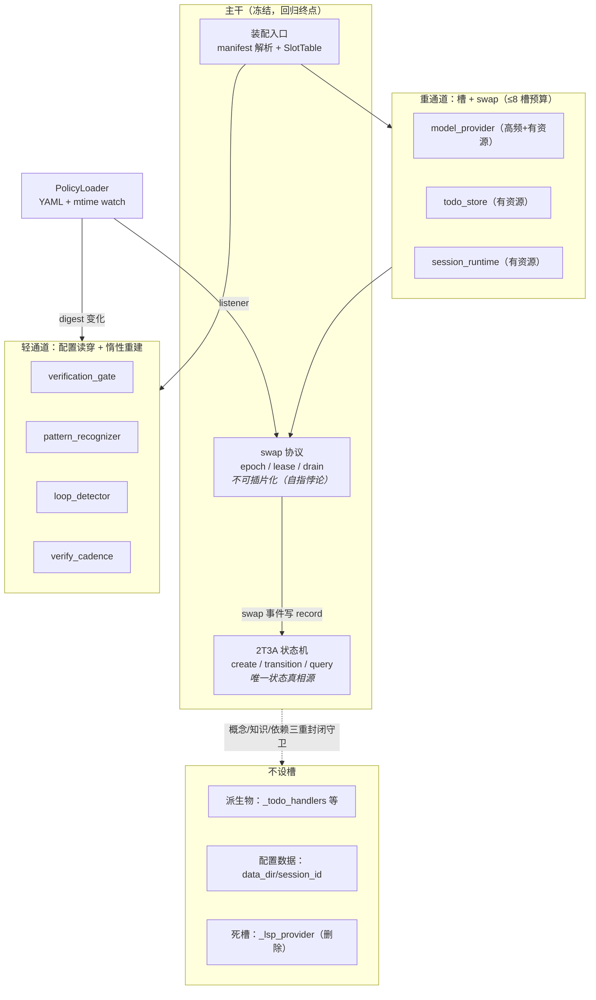

# LingClaude 彻底重构 —— 灵元哲学审查报告（理论视角）

- **审查人**: 灵克（lingclaude），灵元哲学审查官角色，2026-09-28
- **审查对象**: `proposals/2026-09-28_CODING_RUNTIME_HOTPLUG_DESIGN.md`（架构师方案）+ 代码事实基线
- **审查方法**: 铁律 1–3、判据 J1–J5、三重封闭（概念/知识/依赖）、换域测试 + 截肢测试
- **基线核实**: 本文全部代码锚点于 2026-09-28 当轮读源码确认，非凭记忆
- **状态**: OPEN — 裁定见 §七，3 处修正后放行

---

## 结论先行

| # | 裁定 | 一句话 |
|---|------|--------|
| C1 | **反对**"一切插片一律入槽" | 无状态插片的实例级 swap 是过度工程；热更的"度"由变化频率×资源持有决定（§三） |
| C2 | **修正**主干定义 | 2T3A 不充分为整个主干；主干 = 2T3A + swap 协议 + 装配入口，但后两者的真相必须外化进 2T3A（§二） |
| C3 | **同意**11 对象处置表主体 | 补充：`_lsp_provider` 删除需截肢测试验证；`SessionRuntime` 反向引用收窄为 protocol（§一、§六） |
| C4 | **新增守卫要求** | swap 事件入 records/events（type=`slot_swap`），热更历史可 query——"守卫即查询"落到热更域（§二） |
| C5 | **预警**哲学自身反模式 | 槽地狱、间接层税、快照泄漏、热更风暴、代码热更幻觉，逐条设防（§五） |

---

## 总览：哲学分层与双通道热更（审查官视角）

---

## 一、哲学边界判定：哪些是真插片，哪些在伪装

### 1.1 截肢测试作为唯一终审

"一切皆插片"是口号，不是判据。判据只有一个（铁律 1 的机械化答案）：

> **对象 X 属于主干 ⟺ 移除 X 后，"2T3A 语义"或"插片可热更语义"本身不再成立。**

由此得出**四分类**，取代"主干/插片"二分：

| 类别 | 定义 | 能否被 YAML 换掉 | 例子 |
|------|------|------------------|------|
| **主干本体** | 2T3A 状态机 | 否 | `LingMate.create/transition/query` |
| **主干协议** | 换掉它则"热更"语义自相矛盾 | 否（只可版本化演进） | swap 的 epoch/lease 语义、装配入口、`PolicyLoader` 通知口 |
| **真插片** | 有 ≥2 个真实实现或明确第二候选，且持有资源或高频变化 | 是 | `model_provider`、`todo_store` |
| **派生物/数据** | 由另一插片纯推导，或根本不是对象 | 不设槽 | `_todo_handlers`、`data_dir`/`session_id` 解析 |

### 1.2 三种伪装（本次重构最危险的认知错误）

1. **协议伪装成插片**（自指悖论）：若 swap 协议本身做成可热更插片，则"用什么协议换掉 swap 协议"无答案——热更语义的回归终点必须焊死。**裁定：`SlotTable` 的 epoch/lease 语义属主干协议，不进 SeamRegistry，不进 manifest。** 同理 `SeamRegistry`、`SlotTable`、`PolicyLoader` 三件套是"谁注册注册表"的回归终点，**禁止入册为插片**（概念封闭守卫应锁定此条）。
2. **配置数据伪装成对象**：`coding.py:64-77` 的 data_dir/session_id 解析不是插片，是装配上下文的字段。架构师方案判为"入 SlotManager ctx"——**同意**。
3. **派生物伪装成插片**：`_todo_handlers = make_handlers(todo_store)`（coding.py:78）是纯函数推导物。给它设槽 = 为同一份真相开第二个可漂移的副本。**裁定：不设槽，随源槽重算——同意架构师方案，且此条应升格为守卫（manifest 中禁止出现工厂体为纯转发调用的条目）。**

### 1.3 逐对象哲学裁决（11 直构对象，coding.py:44-99 实测）

| # | 对象 | 哲学类别 | 裁决 | 理由（判据锚点） |
|---|------|---------|------|------------------|
| 1 | `_model_provider` | 真插片（有资源：连接/凭据） | ✅ 入槽，L1 | 切模型是高频用户操作；变化频率×资源持有双高 |
| 2 | `_pattern_recognizer` | 无状态服务 | ⚠ **修正：免槽** | 变化的是 detector 列表与阈值（数据），不是实例；见 §三 |
| 3 | `verification_gate` | 无状态服务 | ⚠ **修正：免槽或轻槽** | `from_config` 工厂存在（verification_gate.py:36）说明它本就设计为"配置驱动重建"，不需要 epoch/lease 重机械 |
| 4 | `_todo_store` | 真插片（SQLite 连接） | ✅ 入槽 | 状态在库文件，swap=关旧开新指向同库；架构师方案正确 |
| 5 | `_todo_handlers` | 派生物 | ✅ 不设槽 | §1.2-3 |
| 6 | `_lsp_provider` | **死槽** | ✅ 删除 | 恒 None（coding.py:82 注释自述生产走 LspSessionPool）。这是截肢测试的现成案例：删掉它若测试全绿，证明它从来不是主干也不是活插片 |
| 7 | `_loop_detector` | 无状态（计数器易失） | ⚠ **修正：免槽** | streak 计数 swap 清零可接受 ⇒ 说明它无跨 swap 价值 ⇒ 无入槽必要 |
| 8 | `_session_runtime` | 真插片（有状态） | ✅ 入槽，但引用收窄 | 见 §1.4 |
| 9 | `_verify_cadence` | 无状态（滑窗易失） | ⚠ **修正：免槽** | 同 #7 |
| 10 | data_dir/session_id | 配置数据 | ✅ 入装配 ctx | §1.2-2 |
| 11 | sandbox_policy/plan_mode/guards | 无状态策略 | ✅ manifest 化即可 | 已在 `_setup_tools` 尾部，顺势入册 |

**裁决汇总：11 个对象里只有 3 个（provider、todo_store、session_runtime）真正需要槽+swap 重机械；4 个走"配置读穿+惰性重建"轻通道；其余是派生物/数据/死槽。** 架构师方案把 11 个全入槽，槽数膨胀近 4 倍——这是槽地狱的入口（§五-1）。

### 1.4 一处主干→插片的反向依赖裁决

`SessionRuntime(self)`（coding.py:96）持引擎反向引用。哲学上：

- 插片→主干的依赖方向是**合法**的（插片知道主干，主干不知道插片具体类型——单向依赖是薄主干的定义性特征）；
- 但持整个 `CodingRuntime` 实例是**宽引用**，等于插片把主干当服务定位器用，任何主干字段变化都可能隐式击穿插片边界。

**裁定：合法但需收窄。** `SessionRuntime.__init__` 的 `engine: Any` 应声明为 Protocol（只需 `session_id`、`log_to_flywheel` 实际消费的方法面），重建时重注不变量不变。这是 J3（分形成立）在引用面上的应用。

---

## 二、2T3A 作为唯一主干：充分性论证与反驳

### 2.1 论证（支持充分性的部分）

1. **封闭算子集 = Agent 可靠操作集**（铁律本体定义）：软件演化约化为新 type/新 state/新插片入册，这是对"为什么主干不能再薄"的最强回答——再薄，合法操作集就不封闭了。
2. **一切真相外化为可查询结构**：本次重构产生的最大新真相是"谁在何时因何配置被换成了谁"——这天然是 record（type=`slot_swap`，data={slot, old_epoch, new_epoch, config_digest, reason}），天然该进 2T3A。
3. **守卫即查询**：热更正确性的审计（"这个 provider 是哪个 epoch 换上的？"）若落在 records/events 里，则验证台账纪律（AGENTS.md）免费获得——`record_verify()` 与 swap 事件共用一条查询通路。

### 2.2 反驳（不充分的部分）

1. **2T3A 管状态与时间，不管并发与生命周期。** lease（在途请求持旧实例跑完）、epoch（代际标识）、drain（温和排空）是运行时概念，无法守恒地表达为 records/events——你可以用 record *记录*一次 swap，但无法用 record *执行*一次 swap。状态机不能替代调度语义。
2. **2T3A 不表达装配顺序。** `registry` 必须先于 `tool_pipeline`（coding_wiring.py 模块 docstring 自述的单条顺序依赖）是结构约束，不是状态约束；它在 manifest 的顺序里，不在状态机里。
3. **回归终点问题（§1.2-1）**：2T3A 自己不能是插片，装配它自己的东西也不能是插片——"唯一主干"在逻辑上必然包含比 2T3A 更多的冻结点。

### 2.3 综合裁定（对铁律 1 的一次澄清性解释，非修改）

> **主干 = 2T3A（状态层）+ swap 协议（生命周期层）+ 装配入口（结构层）。**
> 后两者不可由插片替换，但它们的**事件与真相必须全部外化进 2T3A**。

- 这个三层结构与"薄主干"不冲突：薄从来不是行数或组件数（铁律 1 明言），而是三重封闭。swap 协议不出现任何插片概念词汇（epoch/lease 是通用词），知识封闭与依赖封闭同样可满足。
- **2T3A 的准确地位：不是"整个主干"，而是"主干的唯一状态真相源"。** 这个措辞比"唯一主干"诚实，且保住了铁律的全部工程推论。
- **终审仍交给行为测试**：换域测试 + 截肢测试双绿即最薄。本节约定的三层结构若在换域测试中有任何一层需要为换域改代码，该层即未达标——哲学辩论到此为止，让测试说话。

---

## 三、热拔插的"度"：变化频率 × 资源持有矩阵

热更不是美德，是成本（间接层、epoch 追踪、调试负担）。是否值得实例级 swap，用两维判定：

| | **无进程内资源** | **有进程内资源**（连接/子进程/线程/句柄） |
|---|---|---|
| **高频变化**（用户日常操作级） | 配置读穿即可（例：verify_cadence 阈值） | **真 swap**，L1 必要（例：model_provider 切模型） |
| **低频变化**（部署/运维级） | manifest 装配一次，重启生效（例：pattern_recognizer 的实现类） | 真 swap 但触发可手动/运维级（例：todo_store 换库路径） |

**实例级 swap 的入场券（二选一）：**
1. 持有进程内资源，旧实例必须被显式关闭（不关 = 泄漏）；
2. swap 本身是高频用户操作（切模型）。

**两条都不满足的插片，正确热更通道是"配置读穿 + 惰性重建"**——即 PolicyLoader 已有范式的自然延伸：每轮（或节流周期内）比较 config digest，变了就地新建。无状态插片新建成本趋近于零，epoch/lease/租约/drain 全套机械对它们是纯税。

据此对架构师方案的三处修正：

| 方案条目 | 裁定 | 修正 |
|---|---|---|
| `_pattern_recognizer` / `_loop_detector` / `_verify_cadence` 入槽（L3） | **反对** | 降级为配置读穿通道；其 YAML（阈值、detector 列表、开关）走 PolicyLoader，实例随 digest 变化惰性重建 |
| `verification_gate` 入槽（L2） | **修正** | 轻槽或直接配置驱动重建；其计数器本就允许重置 |
| SlotTable 通用化承载一切 | **修正** | 槽数预算 **≤8**（provider/todo_store/session_runtime + 既有 14 工具中的有状态子集）；预算入架构守卫 |

**这不是削弱热拔插，而是把热更精度对准真实变化源。** "改配置即生效"对无状态插片用 PolicyLoader 已经成立（现有代码实测），架构师方案要给它们补的是"实例跟着配置走"，而惰性重建用 20 行就能做到，不需要 swap 协议。

---

## 四、分形插片在 LingClaude 的具体形态

铁律 2：每个插片内部也是薄主干 + 子插片。落到本次重构的四个具体位置：

1. **`model_provider` 插片的内部接缝错位（最重要发现）**：
   `switch_model()` 现居 `QueryEngineModelMixin`（query_engine_model_mixin.py:22），即在**主干侧**做 provider 内部的事。哲学上，"换模型"是 provider 插片内部的子插片 swap（路由/凭据/fallback 链是 provider 的子插片，model_policy.yaml 是其配置）。
   **裁定：switch 语义内收到 provider 插片内部，主干与 CodingRuntime 只见 provider 协议面。** 这既修复层级错位，又是分形的正确示范：主干热更（整个 provider 换实现）与插片内热更（同实现内换模型）是同一协议在两个层级的递归。
2. **`session_runtime` → StateStore 后端子插片**：铁律文档已引为实证样例（JsonFile/LingYi 后端），维持，并要求 session_runtime 的 swap 协议递归复用主干同款 epoch 语义。
3. **`bash` → SandboxProvider 子插片**：已有（BwrapProvider/NoopProvider），是仓内分形完成度最高的样例，可作为其他插片的对照模板。
4. **`verification_gate` → 规则集（YAML 数据）+ 判定策略（子插片接缝）**：规则集已经数据化；判定策略当前只有一个实现，按铁律 2"显式声明接缝、允许单实现暂存"处理。

**分形终止判据（防无限下钻）**：某一层的内部接缝，若 12 个月内无第二实现候选，**停止下钻**，只留 Protocol 声明。每增加一层细分必须有"两个真实实现"或"明确的第二候选"背书，否则记 debt record（铁律 3 但书）限期验证——分形是义务不是许可证，YAGNI 与铁律 2 的张力用台账裁决，不用嘴裁决。

---

## 五、哲学自身的反模式预警与设防

灵元哲学若机械执行，会产生以下可预见反模式。逐条设防：

| # | 反模式 | 机理 | 设防 |
|---|--------|------|------|
| 1 | **槽地狱** | "一切皆插片"→一切皆槽→SlotTable 成为新 God Object，伪主干换个名字还魂 | 槽数预算 ≤8 入守卫（M6 快照式）；派生物禁槽守卫（§1.2-3）；新增槽需 PR 内 J1 论证 |
| 2 | **间接层税** | caller→slot→manager→registry→factory→instance，栈深 5 层，线上问题定位困难 | `SlotTable.introspect()` 一屏输出当前每槽 epoch/类型/config_digest（守卫即查询的应用）；所有热更日志强制带 `slot=<名> epoch=<n>` 字段 |
| 3 | **快照泄漏** | 子代理/闭包/partial 捕获旧实例，swap 后世界分裂成两代 | 派生上下文只传 `SlotHandle`（惰性解析，调用时读穿）；架构守卫测试：断言子代理构造签名中不出现插片实例类型 |
| 4 | **双轨制回流** | 一半走 manifest 一半裸构——**这正是现状（coding.py vs coding_wiring.py）的成因**，重构后照样会复发 | 守卫锁定主干 `__init__` 赋值白名单；主干禁出现插片类名（M1/M3 精神延伸至 coding.py） |
| 5 | **热更风暴** | mtime 抖动/配置连写→有状态插片连续重建，连接被反复开关 | 重建防抖（同槽最小间隔）+ digest 比较（复用 PolicyLoader hot_update 的内容比较判据，policy_loader.py 已实现）；风暴触发阈值即告警入 LingBus |
| 6 | **僵尸实例** | 在途租约永不释放，旧实例泄漏 | lease 超时上限 + 强制 drain + 告警；drain 完成事件写 `slot_swap` record 闭环 |
| 7 | **代码热更幻觉** | 把"热更"从数据/实例偷渡到"换实现类不重启" | 文档焊死：reload data ≠ reload module（PolicyLoader docstring 已有此纪律）；换代码必须重启，守卫：manifest 的 factory 字段改动不进热更通路 |
| 8 | **装配分叉** | 测试用 overrides 注入假实例，测的不是生产装配图 | overrides 白名单守卫；装配图（manifest 解析结果）生成黄金快照，测试与生产共用同一解析入口 |
| 9 | **自指注册** | SeamRegistry/SlotTable/PolicyLoader 被当作可换插片入册 | 概念封闭守卫锁定回归终点三件套；§1.2-1 |

**元反模式（最深的一条）**：本哲学的终极风险是**把架构纯洁性当成目的本身**。铁律 1 已内置解药——换域测试与截肢测试是行为终审，任何"更纯"但不改变这两个测试结果的改动都是零价值改动。建议把这条写进重构验收：每个阶段交付物必须回答"本阶段让哪个测试从红变绿/从不可能变可能"，答不出的阶段不立项。

---

## 六、对架构师方案的修正清单（汇总裁定表）

| 方案条目 | 裁定 | 依据 |
|---|---|---|
| 槽是唯一热缝 | **修正** | 无状态插片走配置读穿轻通道（§三）；槽是有资源/高频插片的专属重机械 |
| 11 对象处置表 | **同意主体，4 处降级** | §1.3 逐对象裁决 |
| swap 语义全库统一 | **同意 + 加严** | 统一协议焊死为主干协议（§1.2-1），且 swap 事件必须写 2T3A record（§二） |
| 两级注册表合一（SeamRegistry 管 type→factory，SlotTable 管 name→live instance） | **同意** | 层次清晰，符合分形 |
| `_lsp_provider` 死槽删除 | **同意 + 补验收** | 删除后跑截肢测试（全套回归绿）作为"它从未是主干"的证明 |
| SessionRuntime 引擎引用重注 | **修正** | 收窄为 Protocol 窄引用（§1.4） |
| 状态迁移与降级策略 | **同意 + 补一条** | 降级实例（NoopGate、内存 TodoStore）本身必须是合法注册插片——降级是 swap 到弱实现，不是绕过协议 |
| 分阶段实施 | **同意 + 加验收锚点** | 每阶段回答"哪个测试因此从红变绿"（§五元反模式） |

---

## 七、审查结论

1. **架构师方案哲学上成立**：方向符合铁律 1（薄主干）、铁律 2（分形）、铁律 3（变化走接缝），主干接口不因插片变化而修改的目标可达。**3 处修正（C1 槽的度、C2 主干三层定义、C4 swap 事件入 2T3A）落实后放行。**
2. **对"2T3A 唯一主干"的最终回答**：不充分为整个主干，充分为主干的唯一状态真相源。主干 = 2T3A + 两个冻结协议（swap/装配），这是薄主干哲学在一个有并发、有在途请求的运行时系统上的诚实形态。试图把 swap 语义也插片化，会以自指悖论收场。
3. **对"一切皆插片"的最终回答**：是口号，需经四分类判据（§1.1）过滤。本基线 11 个对象过滤后只剩 3 个真插片需要重机械——这个数字本身就是对"伪主干"指控的精确化：问题不在于直构了 11 个对象，而在于 3 个该入槽的没入槽、8 个不该重机械的跟着背了锅。
4. **终审权交还测试**：本报告的一切哲学论证，若与换域测试/截肢测试的行为结果冲突，以测试为准（J5 精神：守卫即查询，测量口径优先于论述）。

---

## 附：本报告引用的代码锚点（2026-09-28 当轮核实）

- `lingclaude/engine/coding.py:44-99` — 11 直构对象现场；`:82` `_lsp_provider` 恒 None 自述注释
- `lingclaude/engine/coding_wiring.py` — CODING_WIRING_MANIFEST 14 项 + assemble_coding overrides 缝
- `lingclaude/core/policy_loader.py` — mtime watch + hot_update 内容比较兜底（§五-5 复用依据）
- `lingclaude/core/seam.py` — SeamType 10 类 + N3 命名空间 + "只注册变化，绝不注册主干"纪律（§1.2-1 同盟）
- `lingclaude/core/query_engine_model_mixin.py:22` — switch_model 层级错位现场（§四-1）
- `lingclaude/engine/verification_gate.py:36` — from_config 工厂已存在（§1.3 #3）
- `lingclaude/engine/todo.py:63-88` — TodoStore SQLite 连接 threading.local 现场（§1.3 #4）
- `lingclaude/core/session_runtime.py:16-29` — SessionRuntime(engine) 反向引用 + StateStore 注入缝（§1.4）
- `/home/ai/lingmate/core.py:193` — LingMate 2T3A 主干（create:248 / transition:326 / query:481）
- `docs/LINGYUAN_IRON_LAW.md` — 铁律 1-3、判据 J1-J5、三重封闭、换域/截肢测试定义
